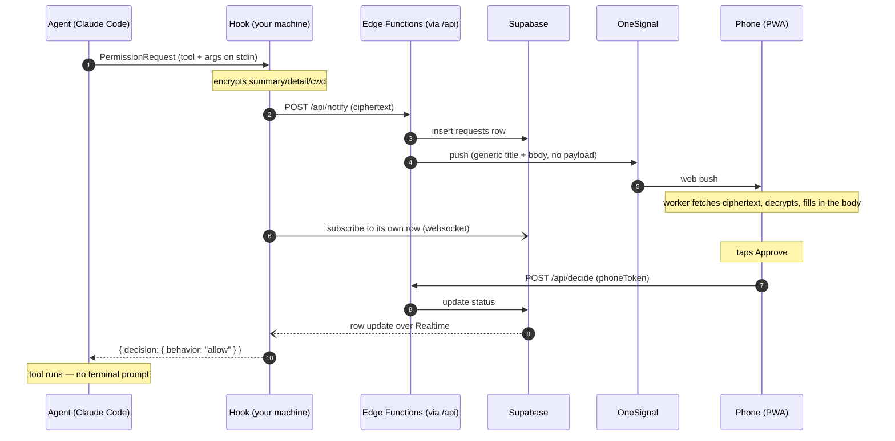

# tapproval

Approve or deny your coding agent's permission prompts from your phone.

Your agent asks to run `rm -rf build/`. Your phone buzzes. You tap Approve
from the lock screen. The agent carries on. You never went back to the
terminal.

Free, no app store, and **the server cannot read your commands** — they are
encrypted on your machine with a key it never holds.

---

## Quick start

```bash
npx tapproval setup   # register, install the hook, print a QR
```

Scan the QR, tap **Enable notifications**, then **restart your agent** — a
running session rewrites its settings file from a startup snapshot and will
delete the hook.

`npm i -g tapproval && tapproval setup` works identically if you'd rather have the
command on your PATH.

<details>
<summary>Why <code>npx</code> is safe here, when it usually isn't for a hook</summary>

`setup` writes an **absolute path** to the hook into `~/.claude/settings.json`,
because your agent spawns that command on every permission prompt and paying npx's
resolution cost each time would be felt — and after a cache prune it would be a
network install with your agent blocked on it.

That path therefore has to outlive `setup`, and an npx cache does not: npm prunes
`~/.npm/_npx/<hash>/` freely. A hook pointing there works today and is gone next
week, failing the way that is hardest to notice — no error, just prompts that
quietly stop reaching your phone.

So when `setup` sees it is running from a disposable cache, it copies its own
runtime to `~/.tapproval/runtime/<version>/` first and points the hook there. What
has to be stable is the path your *agent* runs, not the path *you* ran. The copy is
idempotent, so only the first `npx … setup` pays for it, and older versions are
pruned once the new hook is written. `tapproval uninstall` removes it.

`doctor` reports which copy the hook runs from, and warns if it is stale — an
`npx tapproval@latest` upgrades the CLI you just ran and nothing else until `setup`
repoints the hook.

</details>

That's it. No account, no OneSignal app, no tunnel, no server to babysit.

Not working? `tapproval doctor` checks config, hook registration,
timeout ordering, API reachability, whether Realtime can connect, and whether
your device has been revoked. It diagnoses every failure mode listed in
[Troubleshooting](#troubleshooting).

Want to run the whole thing yourself instead? `tapproval setup
--self-hosted` — see [Self-hosted mode](#self-hosted-mode).

### Commands

```
tapproval setup                 register + install the hook + pair a phone
tapproval pair                  add another phone (asks which platform)
tapproval pair --ios            iPhone: install first, then a code to type
tapproval pair --android        Android / desktop: scan the QR
tapproval pair --code           just a code, for an already-installed app
tapproval doctor                diagnose a setup that isn't working
tapproval uninstall             remove the hook
tapproval mute / unmute         stop / resume phone notifications
tapproval notify Bash Edit      buzz for these tools only
tapproval notify --skip Read    buzz for everything except these
tapproval notify --all          buzz for every prompt (the default)
tapproval notify --grace=10     hold the push 10s (default 30, 0 = at once)
tapproval setup --self-hosted   your own OneSignal app + tunnel
tapproval start                 the local server (self-hosted only)
```

---

## Turning the buzzing down

Every prompt reaching your phone is what you want when you are away from the
machine, and spam when you are sitting at it. Three ways to narrow it, all
enforced **in the hook**, before anything is sent — a filtered prompt makes no
row, no push, and no network call at all:

```bash
tapproval mute                  # nothing reaches the phone
tapproval unmute                # everything does again
tapproval notify Bash Edit      # a shortlist
tapproval notify --skip Read Glob
tapproval notify --all          # back to the default
```

A fourth way is to keep every prompt but make the phone wait a little longer before
it buzzes — see [Tuning it](#tuning-it) under the grace period. That one is usually
the right first move: it removes the notifications you didn't need without
narrowing what you can answer from your phone.

Nothing is dropped by staying quiet: a prompt that does not go to the phone is a
prompt you answer in the terminal, which is exactly where a timeout, a dead
websocket and a crashed hook all land too.

The same settings live in `~/.tapproval/config.json` as `muted`,
`onlyTools` and `skipTools`, and can be overridden per-run with `AAP_MUTE=1`,
`AAP_ONLY_TOOLS=Bash,Edit` or `AAP_SKIP_TOOLS=Read,Glob`. A shortlist wins over a
skip list — set one and the other is cleared, because "these, except those"
resolves to an empty intersection more often than anyone expects.

`doctor` reports which of these is in force. It is the first thing to check when
the phone has gone silent.

---

## What the server can and cannot see

This is the part worth reading twice.

| Can see | Cannot see |
|---|---|
| your `deviceId` (a random uuid) | the command, diff, or file contents |
| the tool name — `Bash`, `Write`, `Edit` | the working directory |
| timestamps, and whether you allowed or denied | your note on a denial |
| your phone's user-agent string | anything OneSignal isn't sent, because it never is |

`summary`, `detail` and `cwd` are encrypted **on your machine** with AES-256-GCM
before the request is sent. The key is generated by the CLI, handed to each
phone once inside a single-use pair code, and deleted from the server the moment
that code is claimed. What lands in Postgres is one opaque blob.

The push notification carries a generic title and body — `Approve Bash?` /
`Tap to review`. The real body is fetched and decrypted by the service worker on
your phone and written into the notification in place. If that fails you see the
generic body; plaintext never reaches OneSignal either way.

You can check all of this rather than believing it — see
[Verifying hosted mode](#verifying-hosted-mode).

---

## Questions, not just permissions

Some prompts are not "may I?" but "which one?" — `AskUserQuestion`, where Claude
offers a few options and waits for a pick. Approve/Deny cannot answer that, so
those requests get a different screen: the options themselves are the buttons.

- One single-choice question sends on the tap, so answering costs exactly what
  approving a command does. Multi-select, or more than one question, gets a
  confirm step — a tap there means "also this", not "that one, done".
- **Dismiss** denies. It tells Claude nothing was chosen rather than picking for
  you, and the terminal takes over.
- The notification carries no Approve/Deny buttons for these, in either of the two
  places that could add them: the push itself leaves `web_buttons` off when the
  tool is `AskUserQuestion`, and the service worker leaves `actions` empty once it
  has decrypted the payload and found questions in it. A verdict would settle the
  request having decided nothing, so the only path is the option list. The same
  rule holds for the `?a=allow` deep link and the dry-run output — neither will
  put a verdict on a question.

The answer travels back inside the same AES-256-GCM envelope the request arrived
in: which option you chose is your content too, and the server stores it as a
second opaque blob (`answer_ciphertext`). The hook decrypts it, checks every
label against the options it actually sent — anything else is dropped — and
allows the tool with `answers` filled in, so the tool returns your picks instead
of prompting again.

A selection that cannot be read or cannot be matched is not a guess: it falls
through to the terminal prompt like every other failure here.

---

## The push waits before it buzzes

The terminal prompt and the hook run at the same time and race each other. When
you are sitting at the machine you win that race every time, seconds before you
could have reached for a phone — so the notification arrives for something already
decided. It buzzes, you look, there is nothing to do. Enough of those and the
notification stops meaning anything, which is the only way this tool really fails.

So the push is held back for `graceSec` (30 by default). During the pause the hook
watches the transcript for **this exact call** being answered; if it is, nothing is
ever created — no row, no push, nothing on your phone to dismiss. If the pause
passes in silence you are not at the keyboard, and the phone rings.

It is cheap because nothing exists yet: one file read per poll, no network, and
being killed mid-pause needs no cleanup at all. The pause only delays the *push* —
the wait for your phone still gets its full `timeoutSec` afterwards.

One subtlety worth knowing about, because getting it wrong would be invisible: an
identical command run earlier in the session already has a result sitting in the
transcript. Only results that appear *after* the pause starts count, or a loop
would silence its own notifications.

### Tuning it

```bash
tapproval notify --grace=10     # buzz sooner — 10s at the keyboard, then the phone
tapproval notify --grace=60     # a minute of quiet before anything reaches the phone
tapproval notify --grace=0      # no pause at all: notify immediately
```

Accepted range is 0–300 seconds. The right value is a personal measurement, not a
default anyone can pick for you: **how long you take to notice and answer a prompt
when you are already at the machine.** Set it just above that.

- Too **low** and you get notifications for prompts you were about to answer
  anyway. Nothing breaks, but they train you to ignore the buzz — which is the one
  way this tool genuinely stops working.
- Too **high** and prompts sit silently while you are away from the desk, eating
  into the window in which the agent is blocked and waiting.

`--grace=` is its own flag rather than a config edit for one reason: **it re-runs the
hook installer for you.** The agent kills the hook at a fixed `timeout` in
`~/.claude/settings.json`, derived as `graceSec + timeoutSec + 60` — so a grace
period that grows without that timeout growing with it gets the hook killed
mid-wait, and the decision is lost. Editing `graceSec` in the config file by hand
does *not* move it, so **re-run `tapproval setup` if you do that** (same for
`timeoutSec`, which has no flag). `AAP_GRACE=10` works for a one-off run, and is
safe because it only ever shortens the total.

`doctor` checks the ordering explicitly and is the fastest way to confirm you are
not in that state:

```
✓ holding the push 30s — answering in the terminal first means no notification
✓ hook timeout 390s > grace 30s + wait 300s
```

A `✗` on the second line means exactly one thing: re-run `setup`.

---

## The prompts you answer at the keyboard

Most prompts never reach the phone in time, because you were sitting at the
machine and just pressed a key. Those used to leave nothing behind: the hook
withdrew the request on its way out and the row said `cancelled` — "your machine
stopped waiting" — with no verdict attached. The history was blank exactly where
the common case lives.

A second hook fills it in afterwards, from facts rather than inference:

| It fires on | What it knows | Recorded as |
|---|---|---|
| `PostToolUse` | the tool ran, and nothing runs without permission | `local_allow` |
| `PostToolUse` (`AskUserQuestion`) | the response carries the selection you made | `local_answer` |
| `Stop` | the transcript holds Claude Code's own "the user doesn't want to proceed" | `local_deny` |
| `SessionEnd` | nothing more is coming | left as `cancelled` |

The last row is the point. An interrupted prompt, or one abandoned when the
session ended, has no decision to record — those stay `cancelled`, and the phone
still says "no longer waiting". Nothing here guesses a verdict.

How the two ends find each other: the permission hook drops one small file in
`~/.tapproval/pending/` before it exits, holding the request id, the session id,
the tool name, and a **hash** of the tool input. Never the input itself — the
command does not get written anywhere it does not have to be. The reconcile hook
matches on that hash, so two `Bash` calls in one session are not confused for
each other, and a trace from another terminal is not settled by this one.

It runs on every tool call, so it is built to cost nothing when there is nothing
to do: one `readdir` of an empty directory and it exits, before it has read the
config or opened a socket.

The report goes to `/api/local-decide` with the machine token, and the write is
conditional on the row not already carrying a phone verdict. So if you tapped
Approve a second before the prompt fell through, your tap stands and the report
is a no-op — the phone's answer is the one the agent acted on.

In the history these read as `Approved · terminal`, `Denied · terminal` and
`Answered · terminal`, in the same colour as their phone-side twins but hollow,
because the verdict is the same and only the place changed. A selection made in
the terminal is encrypted on your machine like every other one; the server stores
a blob it cannot read.

---

## How it works



Each piece does exactly one thing:

- **Vercel** — static only. Serves the PWA and proxies `/api/*` to the functions;
  it runs no code of ours.
- **Supabase Edge Functions** — the nine HTTP routes, every one sub-second.
  Never holds a connection open.
- **Supabase Postgres** — all state, all RLS-scoped by device.
- **Supabase Realtime** — the return path. Zero function invocations while waiting.
- **OneSignal** — outbound push only, targeted by `external_id`.

### Why Realtime and not polling

An Edge Function should not hold the 25-second long-poll that self-hosted mode uses.
Short-polling the five-minute wait would cost ~100 invocations per approval —
a few hundred approvals on the free tier. The websocket costs nothing while
waiting and is faster.

If the websocket cannot connect or drops, the hook falls back to polling
`/api/request` every 3 seconds for the remainder of the wait, and says so on
stderr. A dead websocket never means a missed approval. (On Node 20 there is no
global `WebSocket`, so hosted mode always uses the fallback; Node 22+ removes
the extra latency. `doctor` tells you which one you're on.)

### Why the hook can decide anything at all

Claude Code's `PermissionRequest` hook is spawned as a child process, blocks
the agent, and its **stdout is the decision**:

```json
{ "hookSpecificOutput": {
    "hookEventName": "PermissionRequest",
    "decision": { "behavior": "allow" } } }
```

`behavior` is `allow` or `deny`. Omitting `decision` entirely falls through to
the normal terminal prompt — which is how every failure path here stays safe.

There is no IPC, no socket. Just a subprocess and its stdout. Anything that
can spawn a process and read stdout can host this.

### Fails safe, by construction

| Failure | Result |
|---|---|
| You answer in the terminal within the grace period | no push is ever sent |
| Nobody answers in time | terminal prompt |
| API down, DB down, OneSignal error | terminal prompt |
| Websocket refuses to connect or drops | polling fallback, then terminal prompt |
| Hook crashes | terminal prompt |
| The hook's own file is deleted from under it | terminal prompt (and `doctor` names it) |
| Late tap after timeout | phone says "Timed out", agent unaffected |
| Phone cannot decrypt | phone says so and offers no Approve button |
| Answer names an option Claude never offered | dropped, then terminal prompt |
| Reconcile hook cannot reach the API | history entry missing, nothing else |

The only path that produces a decision is a deliberate tap. There is no
configuration in which this auto-approves. `npm test` proves the error paths
rather than asserting them.

---

## Three tokens, not one

Self-hosted mode's `deviceId` was identity, CLI credential, phone credential and
QR payload all at once — unrotatable, unrevocable, and permanently embedded in a
QR you were told not to screenshot. Hosted mode splits it:

| Token | Purpose | Lives | Secret? |
|---|---|---|---|
| `deviceId` | identifier; OneSignal `external_id` | anywhere | no |
| `machineToken` | authenticates `POST /api/notify` | laptop config only | yes |
| `phoneToken` | authenticates decisions, one row per phone | that phone's `localStorage` | yes |

Only **sha256 hashes** of `machineToken` and `phoneToken` are stored, so neither
can be read back out of the database — by an attacker, or by us.
`machineToken` never appears in a URL, a QR, a notification, or a log line.

Per-phone tokens mean a lost phone can be revoked (`update phones set revoked_at
= now() where id = …`) without re-pairing the others.

### Pair codes

The QR carries `https://<domain>/p/K7F2QX`: six characters from a 31-symbol
alphabet with no `0/O/1/I/L`, single use, 120-second TTL, rate-limited per
device. `POST /api/claim` trades it for a `phoneToken` and the payload key, then
the code is dead. Screenshot it into a demo video if you like.

Several phones can pair to the same device and any of them can answer — first
tap wins, the rest see "Already answered". They share the payload key.

---

## Platform reality

| | Android / desktop Chrome | iOS |
|---|---|---|
| Buttons on the notification | ✅ one tap | ❌ never |
| How you answer | lock screen | tap notification → PWA → tap |
| Install required | no | yes, Add to Home Screen |

**iOS has no notification action buttons for web push.** WebKit ignores the
`actions` array and doesn't even deliver `event.action` to the service worker.
Unchanged since web push landed in 16.4. Nothing works around it — the
tap-through page is the only path, and the PWA recovers the pending request
even though iOS drops the notification's target URL.

**Android answers inside the service worker**, via `fetch`, not by opening a
URL. Mobile Chrome refuses to foreground itself for an action-button click, so
URL-based buttons silently do nothing. `public/OneSignalSDKWorker.js` holds
the `notificationclick` handler that makes it work — it looks like a
throwaway import file. It is not. Don't "clean it up".

### iPhone pairing

**Install first, pair second — and do not scan a pair code.**

`tapproval pair --ios` walks this in the right order: it shows a QR of the bare
site root (safe to scan, carries no code), waits for you to finish installing, and
only *then* mints the code — so its two-minute life starts when you are ready to
type it, not while you are hunting for Add to Home Screen.

1. Open the site root in **Safari** → Share → **Add to Home Screen**
2. Open it from the **icon**
3. `tapproval pair --code` on your computer, and *type* the six characters
   into the app
4. Enable notifications

Scanning the QR with an iPhone pairs Safari, not the app. A Home Screen web app
gets its own storage container, so the `phoneToken` Safari receives is invisible
to the installed app, which keeps showing "Pair this phone". iOS also opens a
scanned link in Safari rather than the app, and the manifest's `start_url` drops
the `/p/<code>` path — so there is no arrangement in which a scan reaches the
installed app. The code is single-use, so a scan actively costs you one: get a
fresh code before typing.

The QR is for Android and desktop, where the browser that scans it is the
browser that keeps the credentials.

Granting notification permission from a normal Safari tab silently does nothing,
which is why the install has to come first regardless.

The default wait is five minutes, which is what the iOS path actually needs:
notification → unlock → PWA cold start → read → tap does not fit in ninety
seconds. Nothing is spent while waiting — the hook is parked on a websocket, not
polling — so a longer wait only means an unanswered prompt takes longer to fall
through to the terminal. Lower it if you would rather it gave up sooner.

---

## Configuration

`~/.tapproval/config.json`, mode `0600` — it holds your machine token and
your payload key.

```jsonc
{
  "mode": "hosted",              // or "self-hosted"
  "apiBase": "https://…",
  "deviceId": "…",
  "machineToken": "…",           // hosted only
  "payloadKey": "…",             // hosted only — lose this and phones must re-pair
  "supabaseUrl": "…",            // for the Realtime subscription
  "supabaseAnonKey": "…",
  "timeoutSec": 300,
  "graceSec": 30
}
```

| Key | Default | |
|---|---|---|
| `mode` | `hosted` | |
| `timeoutSec` | 300 | how long the hook waits for your phone |
| `graceSec` | 30 | hold the push back this long; 0 notifies immediately. Prefer `notify --grace=N`, which fixes the kill timeout too |
| `apiBase` | the public deployment | hosted |
| `publicUrl` | — | self-hosted: your tunnel, no trailing slash |
| `port` | 8787 | self-hosted |
| `onesignalAppId` / `onesignalApiKey` | — | self-hosted |

Every field can be overridden by an env var (`AAP_MODE`, `AAP_API_BASE`,
`AAP_TIMEOUT`, `AAP_GRACE`, `DEVICE_ID`, `PUBLIC_URL`, `PORT`, `ONESIGNAL_*`). The hook reads its own small
file, `~/.claude/tapproval.json`, also `0600`, and takes
`AAP_*` overrides too.

The hook's kill timeout in the agent's settings is derived as
`graceSec + timeoutSec + 60`, so **re-run `setup` after editing either by hand** —
otherwise the hook is killed mid-wait and the decision is lost. `notify --grace=N`
does that for you; a config edit does not. `doctor` verifies the ordering.

`setup` also decides *where* the hook is run from, and re-running it is how a
vendored runtime gets repointed after an upgrade — see the note under
[Quick start](#quick-start).

### Which prompts notify you

`setup` registers the hook with no `matcher`, so every permission prompt goes
to your phone. To narrow it, edit `hooks.PermissionRequest[0].matcher` in your
agent's settings to something like `Bash|Write|Edit`.

`matcher: "*"` is **invalid** — it's parsed as a regex and throws. Omit it to
match everything.

---

## Self-hosted mode

Still fully supported, and still the only mode with no third party in the path
at all.

```bash
tapproval setup --self-hosted   # OneSignal creds + tunnel URL
tapproval start                 # run the server (keep it running)
tapproval pair                  # QR to pair your phone
```

What you need to bring:

1. **A free [OneSignal](https://onesignal.com) app** with the Web platform
   enabled. Copy the App ID and REST API Key from Settings → Keys & IDs, set
   the **Site URL** to your public URL, and turn off *Welcome Notification*.
2. **A public HTTPS URL** for your machine:
   - `ngrok http 8787 --url=<your-static>.ngrok-free.app` — claim the one
     free static domain, or the URL changes on every restart and breaks both
     your config and OneSignal's Site URL
   - `cloudflared tunnel --url http://localhost:8787` — no interstitial page

Requests live in memory here, the long-poll replaces Realtime, and the payload is
served from your machine to your phone in the clear over the tunnel — there is no
third party to encrypt it from. The pairing QR carries the device secret, so
don't screenshot that one.

---

## Deploying your own hosted instance

The API is nine Supabase Edge Functions. Vercel runs no code — it serves
`public/` and proxies `/api/*` at the edge.

```bash
supabase link --project-ref <ref>
supabase db push                 # applies supabase/migrations/

# three secrets, and nothing else
supabase secrets set \
  AAP_JWT_SECRET="$JWT_SECRET" \
  ONESIGNAL_APP_ID=… \
  ONESIGNAL_API_KEY=… \
  PUBLIC_BASE_URL=https://your-app.vercel.app

supabase functions deploy        # all nine, from supabase/functions/
```

`SUPABASE_URL`, `SUPABASE_ANON_KEY` and `SUPABASE_SERVICE_ROLE_KEY` are injected
into every Edge Function automatically — do not set them.

| Secret | |
|---|---|
| `AAP_JWT_SECRET` | your project's JWT secret (Settings → API → JWT Secret): signs the device-scoped Realtime token. The one Supabase value that is *not* injected, and it cannot be called `SUPABASE_JWT_SECRET` here because `supabase secrets set` reserves the `SUPABASE_` prefix. The functions read either name, so `.env` and `functions serve --env-file` can keep using the dashboard's. Without it `/api/notify` 500s and every approval degrades to the hook's polling fallback |
| `ONESIGNAL_APP_ID` / `ONESIGNAL_API_KEY` | one app, all tenants |
| `PUBLIC_BASE_URL` | **the Vercel domain**, not the functions domain — it builds the URLs inside a push, and `<ref>.supabase.co` serves no HTML |
| `DRY_RUN` | optional; `1` logs the decision URLs instead of pushing |

Then the static side:

```bash
# vercel.json — replace the placeholder with your project ref
"destination": "https://<ref>.supabase.co/functions/v1/:path*"
vercel deploy --prod
```

That rewrite is load-bearing, not cosmetic: `public/OneSignalSDKWorker.js` calls
`fetch('/api/decide')` from inside the service worker and has to stay
same-origin. Everything — the PWA, the hook, the worker — talks to
`https://your-app.vercel.app/api/*` and never to the functions host directly.

`supabase/config.toml` sets `verify_jwt = false` on all nine. These routes carry
their own credentials (a machineToken or phoneToken, matched against a sha256
hash), and `/api/devices` and `/api/claim` are unauthenticated by design; with the
gateway's default JWT check on, every route would 401 before the handler ran.

Then point the CLI at it: `AAP_API_BASE=https://your-app.vercel.app tapproval
setup`, or set `apiBase` in the config file.

Check the wiring with `curl https://your-app.vercel.app/api/health` — it reports
which secrets are present (booleans, never values) and probes all four tables.

Set the OneSignal **Site URL** to your deployment and turn off *Welcome
Notification* — it's on by default and double-fires, once on subscribe and once
on `login()`.

The `pg_cron` sweeper flips expired requests and deletes rows older than 7 days.
If `pg_cron` isn't enabled the migration skips scheduling it; expiry still works,
because `/api/request` and `/api/decide` settle a stale row on read.

---

## Verifying hosted mode

`npm test` proves what can be proven without a phone or a deployment:

- the encryption round-trips through both Node **and** WebCrypto (the browser
  path), a tampered blob is rejected, and a different key cannot read it
- the hook never emits `allow` on any error path — unconfigured, API down, bad
  key, server down — and its stdout is always exactly one JSON object
- the request body contains no `summary`/`detail`/`cwd` at all, and the machine
  token travels in the header
- the polling fallback still delivers a decision with the websocket unavailable
- the vendored runtime survives what it exists for: vendor out of a fake npx cache,
  **delete the cache**, and the hook still starts and still resolves its
  dependencies from the copy
- self-hosted mode still works end to end against the real `server.mjs`
- every API route, on the Deno runtime they deploy to, driven end to end
  against an in-memory PostgREST stub behind the real supabase-js client: register →
  mint code → claim → notify → read → decide, plus a claimed code rejected on
  reuse, an expired code rejected, a late tap reported as `expired` rather than
  `allow`, and a second device unable to read or decide the first device's
  request

The rest needs a real device:

- Approve **and** deny from Android lock-screen buttons with Chrome fully closed
- Approve from an installed iOS PWA via tap-through
- Let one time out → terminal prompt appears; then tap late → phone says
  "Timed out"
- Turn off wifi mid-wait, back on → `[approval-hook] falling back to polling`
  on stderr, decision still lands
- Inspect the row directly and confirm there is no plaintext:
  ```sql
  select tool, status, payload_ciphertext from requests order by created_at desc limit 1;
  ```
- Register a second device and confirm its `machineToken` gets 404 for the
  first device's request id, and its phone cannot decide it
- Claim a pair code twice → second attempt 410; wait out a code → 410

`DRY_RUN=1` on the deployment prints the review and decision URLs instead of
pushing, which is how to find transport bugs without a phone at all.

---

## Security

- `machineToken` and `phoneToken` are stored as sha256 hashes only. HTTPS only.
- Every table has RLS enabled and forced. `devices`, `phones` and `pair_codes`
  have no policies at all and no grants to `anon`/`authenticated` — they are
  reachable only through the service-role key. `requests` grants `select` to
  `authenticated`, scoped by a `device_id` claim in a short-lived JWT.
- The Realtime token is read-only, device-scoped, and expires with the wait. It
  cannot decide anything.
- Notification action buttons target `/r/<id>?a=<verdict>`, a page that
  authenticates with the phone's own token. There is no unauthenticated
  decision endpoint.
- Decisions are a single conditional `UPDATE` — still pending, not expired, right
  device. Two phones racing produce one winner; a tap a second after expiry
  cannot flip a row the hook has stopped listening to.
- Device registration is unauthenticated, which is what makes `setup`
  promptless. A registered device is inert until a phone claims a pair code.
- `payloadKey` is your data. It is in `~/.tapproval/config.json` and on
  your paired phones, and nowhere else. Lose it and phones must re-pair.

---

## Troubleshooting

Run `doctor` first. Then:

**Nothing happens on a permission prompt.**
The hook isn't registered or wasn't reloaded. Check
`jq '.hooks.PermissionRequest' ~/.claude/settings.json`, then restart the
agent. A session started before install rewrites settings from its startup
snapshot and deletes the hook.

**It worked for a while, then silently stopped.**
`doctor` — the likely answer is a hook path that no longer exists. Either the
global package was removed without running `uninstall`, or an older version pointed
the hook into an npx cache that npm has since pruned. `npx tapproval setup` fixes
both: it copies the runtime to `~/.tapproval/runtime/` and repoints the hook there.
The hook fails safe while broken, so every prompt goes to the terminal and nothing
is auto-approved — which is also why it is easy to miss.

**Prompts reach the phone late, or the terminal prompt appears while my phone is
still buzzing.**
The two are related: the push is held back by `graceSec` and the agent kills the
hook at `graceSec + timeoutSec + 60`. If you edited either value in
`config.json` by hand, the kill timeout did not move with it. Re-run `setup`, or
set the grace period with `tapproval notify --grace=N`, which does it for you. See
[Tuning it](#tuning-it).

**The phone never buzzes, but `doctor` is all green.**
Check the grace period line. At `graceSec: 30` a prompt you answer within thirty
seconds is *designed* to never reach your phone — `doctor` prints the value for
exactly this reason. `tapproval notify --grace=0` to see a push immediately.

**Notification arrives, buttons do nothing (Android).**
Stale service worker. Chrome → Settings → Site settings → your domain →
**Clear & reset**, reload, re-subscribe. Verify by opening
`https://<domain>/OneSignalSDKWorker.js` — you should see a
`notificationclick` handler, not just the imports.

**Notification says "Tap to review" instead of the command.**
The worker couldn't decrypt: it has no key (phone paired before this feature, or
`localStorage` cleared), or the fetch failed. Re-pair. The notification is still
answerable — only the preview is missing.

**The page says "Cannot read this request".**
This phone holds the wrong payload key — usually because `setup` was re-run and
generated a new one. `tapproval pair` and scan again.

**Notification tap opens the app but shows the pairing screen.**
The phone isn't paired, or the request already expired. Re-run `pair`.

**Two identical "Thanks for subscribing" notifications.**
OneSignal's Welcome Notification. Settings → Web Configuration → disable. It
double-fires because subscribing and then `login()` both trigger it.

**`doctor` says the API rejected the machine token.**
The device was revoked, or the config is stale. Run `setup` again — it will
register a new device, and you'll need to re-pair your phones.

**Self-hosted: everything looks right but nothing reaches the server.**
Your tunnel is dead. Free ngrok issues a new URL on every restart:
`curl -s -o /dev/null -w '%{http_code}\n' https://<domain>/api/config`
→ anything other than 401 and the tunnel is down. Claim a static domain.
Also: `pkill -f "node server.mjs"` often fails to free the port and the
replacement then silently fails to bind, so you test stale code. Use
`lsof -ti:8787 | xargs kill -9`.

**The phone says Approved but the terminal didn't move.**
The hook wasn't waiting — it never ran. See the first item.

---

## Known limits

- One device per install. Several phones can pair to it and any of them can
  answer.
- The deny note is dropped on `PermissionRequest`; its decision object takes
  `behavior` and `updatedInput`, with no field for text. The note does reach
  the agent when the hook runs as `PreToolUse`, via `permissionDecisionReason`.
- Self-hosted requests live in memory; restarting the server drops pending ones
  (they time out to the terminal prompt). Hosted mode persists them.
- Revocation is a SQL update today, not a CLI command.

### Also planned

- `launchd` / `systemd` unit for the self-hosted server
- `revoke` / `phones` CLI commands
- more `updatedInput` uses — it already carries `AskUserQuestion` answers, and
  the same mechanism makes "approve, but add `--dry-run`" possible from your phone
- Telegram as an alternate transport, the only way to get real one-tap
  buttons on iOS

---

## Development

```bash
npm test                     # the invariants that don't need a phone
npm run dev:hosted           # static + /api proxy locally, no Vercel CLI needed
npm run dev                  # self-hosted DRY_RUN: prints allow/deny URLs
```

`npm test` needs both Node and [Deno](https://deno.com) on PATH: the hook and the
CLI are Node, the API is Deno, and each suite runs on the runtime that ships it.
The Supabase CLI is only needed to serve or deploy the functions.

### Running hosted mode locally

Two processes: `supabase functions serve` runs the real functions on the real
runtime, and `scripts/dev-hosted.mjs` is everything `vercel.json` does — static
files, the three HTML rewrites, and `/api/*` proxied to them — so the worker's
`fetch('/api/decide')` stays same-origin and a tunnel has one port to point at.

You do need a real Supabase project: Realtime is the return path and there is
nothing to stub it with. Create a free one, run both files in
`supabase/migrations/` through the SQL editor, then put the keys in `.env`:

```
SUPABASE_URL=https://xxx.supabase.co
SUPABASE_ANON_KEY=…
SUPABASE_SERVICE_ROLE_KEY=…
SUPABASE_JWT_SECRET=…
ONESIGNAL_APP_ID=…            # omit both with DRY_RUN=1
ONESIGNAL_API_KEY=…
PUBLIC_BASE_URL=http://localhost:3000    # or the ngrok URL, below
```

```bash
supabase functions serve --env-file .env                     # :54321
npm run dev:hosted                                          # :3000, or PORT=…
ngrok http 3000 --url=<your-static>.ngrok-free.app          # claim the free static domain
AAP_API_BASE=https://<your-static>.ngrok-free.app npx . setup
```

Set the OneSignal **Site URL** to the same ngrok URL.

On free ngrok the interstitial appears once per browser session — tap **Visit
Site** on the phone before enabling notifications, and the service worker
registers normally after that. If you install the PWA to the iOS Home Screen,
open the ngrok URL in Safari and clear the interstitial there first; a fresh
standalone context that hits the warning page has no worker.

`DRY_RUN=1` in `.env` (it is the functions that read it now) skips the push and
logs the review/allow/deny URLs instead — enough to exercise the whole flow
without a phone, though `/api/notify` still writes to Postgres.

```bash
# seed a self-hosted pending request so you can look at the UI without a phone
curl -s -X POST localhost:8787/api/notify -H 'content-type: application/json' \
  -d '{"device_id":"dev-secret","tool":"Bash","summary":"rm -rf build/",
       "detail":"rm -rf build/ && npm run deploy","timeout_sec":300}'
```

Then open `http://localhost:8787/p/dev-secret`.

### Layout

```
bin/cli.mjs                  setup / start / pair / doctor / uninstall
lib/config.mjs               ~/.tapproval/config.json + the npx-safe vendoring
lib/crypto.mjs               AES-256-GCM payload encryption (hosted)
lib/wait-hosted.mjs          Realtime subscription + bounded polling fallback
lib/hook-config.mjs          ~/.claude/tapproval.json — the config both hooks read
lib/local-trace.mjs          the breadcrumb linking a withdrawn row to its tool call
lib/transcript.mjs           reading what the terminal did — shared by both hooks
hook/permission-hook.mjs     the subprocess the agent spawns
hook/reconcile-hook.mjs      records what you decided in the terminal (no stdout)
supabase/functions/          the hosted API — one Edge Function per route
  _shared/                   http, db, auth, jwt, push, base, env
  devices/                   register a laptop
  pair-codes/                mint a short-lived code
  claim/                     code → phoneToken + payloadKey (single use)
  notify/                    insert + push + Realtime token, sub-second
  decide/                    the verdict, one conditional UPDATE
  cancel/                    withdraw a row nobody is listening to any more
  local-decide/              what the terminal decided, never over a phone verdict
  request/                   ciphertext for the phone, status for the hook
  health/                    which secret is missing, without echoing any
supabase/config.toml         verify_jwt = false — these routes carry their own auth
supabase/migrations/         schema, RLS, grants, Realtime, sweeper
vercel.json                  static hosting + /api/:path* → functions
server.mjs                   self-hosted HTTP + OneSignal + in-memory state
scripts/install-hook.mjs     merges the hook into settings.json, non-destructively
                             (--root points it at the copy that will still be there)
scripts/dev-hosted.mjs       static + /api proxy locally, mirrors vercel.json
scripts/verify.mjs           npm test — crypto, hook fail-safety, both modes
scripts/verify-api.ts        npm test (Deno) — every route vs an in-memory stub
scripts/make-action-icons.mjs the two notification button icons, generated
public/                      the PWA
  aap-crypto.js              key store (IndexedDB) + decrypt, shared
  OneSignalSDKWorker.js      ← the Android fix. don't touch.
```

`install-hook.mjs` reads → merges → verifies → writes, backs up first, and
aborts if any pre-existing key, hook, or permission entry would be lost. It's
idempotent and reversible with `--remove`. Settings files get large — 900+
permission entries is normal — so never hand-edit or regenerate them.

## License

MIT
