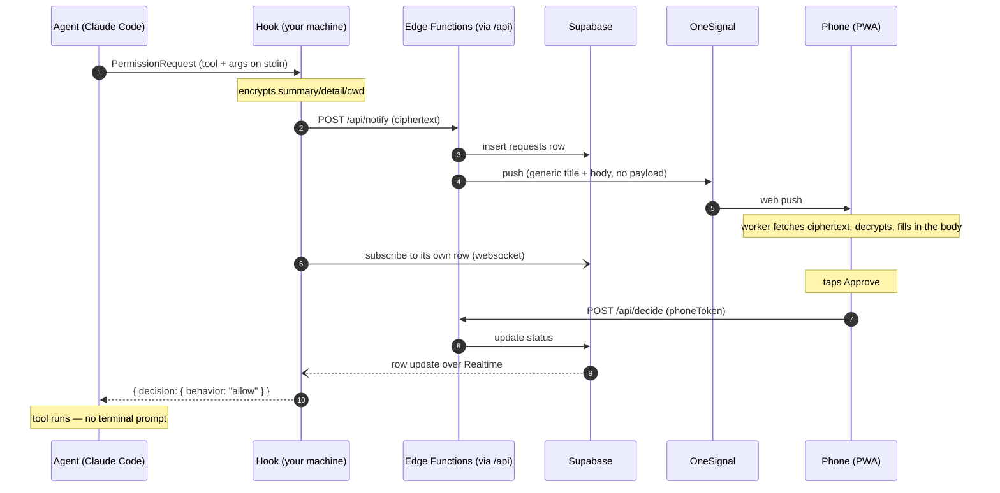

# How tapproval works

[← back to the README](../README.md)

---

## How it works



Each piece does exactly one thing:

- **Vercel** — static only. Serves the PWA and proxies `/api/*` to the functions;
  it runs no code of ours.
- **Supabase Edge Functions** — the eight HTTP routes, every one sub-second.
  Never holds a connection open.
- **Supabase Postgres** — all state, all RLS-scoped by device.
- **Supabase Realtime** — the return path. Zero function invocations while waiting.
- **OneSignal** — outbound push only, targeted by `external_id`.

### Why Realtime and not polling

An Edge Function should not hold the 25-second long-poll that self-hosted mode uses.
Short-polling the five-minute wait would cost ~100 invocations per approval —
a few hundred approvals on the free tier. The websocket costs nothing while
waiting and is faster.

If the websocket cannot connect or drops, the hook falls back to polling
`/api/request` every 3 seconds for the remainder of the wait, and says so on
stderr. A dead websocket never means a missed approval. (On Node 20 there is no
global `WebSocket`, so hosted mode always uses the fallback; Node 22+ removes
the extra latency. `doctor` tells you which one you're on.)

### Why the hook can decide anything at all

Claude Code's `PermissionRequest` hook is spawned as a child process, blocks
the agent, and its **stdout is the decision**:

```json
{ "hookSpecificOutput": {
    "hookEventName": "PermissionRequest",
    "decision": { "behavior": "allow" } } }
```

`behavior` is `allow` or `deny`. Omitting `decision` entirely falls through to
the normal terminal prompt — which is how every failure path here stays safe.

There is no IPC, no socket. Just a subprocess and its stdout. Anything that
can spawn a process and read stdout can host this.

### Fails safe, by construction

| Failure | Result |
|---|---|
| You answer in the terminal within the grace period | no push is ever sent |
| Nobody answers in time | terminal prompt |
| API down, DB down, OneSignal error | terminal prompt |
| Websocket refuses to connect or drops | polling fallback, then terminal prompt |
| Hook crashes | terminal prompt |
| The hook's own file is deleted from under it | terminal prompt (and `doctor` names it) |
| Late tap after timeout | phone says "Timed out", agent unaffected |
| Phone cannot decrypt | phone says so and offers no Approve button |
| Answer names an option Claude never offered | dropped, then terminal prompt |
| Reconcile hook cannot reach the API | history entry missing, nothing else |

The only path that produces a decision is a deliberate tap. There is no
configuration in which this auto-approves. `npm test` proves the error paths
rather than asserting them.

---

## Three tokens, not one

Self-hosted mode's `deviceId` was identity, CLI credential, phone credential and
QR payload all at once — unrotatable, unrevocable, and permanently embedded in a
QR you were told not to screenshot. Hosted mode splits it:

| Token | Purpose | Lives | Secret? |
|---|---|---|---|
| `deviceId` | identifier; OneSignal `external_id` | anywhere | no |
| `machineToken` | authenticates `POST /api/notify` | laptop config only | yes |
| `phoneToken` | authenticates decisions, one row per phone | that phone's `localStorage` | yes |

Only **sha256 hashes** of `machineToken` and `phoneToken` are stored, so neither
can be read back out of the database — by an attacker, or by us.
`machineToken` never appears in a URL, a QR, a notification, or a log line.

Per-phone tokens mean a lost phone can be revoked (`update phones set revoked_at
= now() where id = …`) without re-pairing the others.

### Pair codes

The QR carries `https://<domain>/p/K7F2QX`: six characters from a 31-symbol
alphabet with no `0/O/1/I/L`, single use, 120-second TTL, rate-limited per
device. `POST /api/claim` trades it for a `phoneToken` and the payload key, then
the code is dead. Screenshot it into a demo video if you like.

Several phones can pair to the same device and any of them can answer — first
tap wins, the rest see "Already answered". They share the payload key.

---

## The push waits before it buzzes

The terminal prompt and the hook run at the same time and race each other. When
you are sitting at the machine you win that race every time, seconds before you
could have reached for a phone — so the notification arrives for something already
decided. It buzzes, you look, there is nothing to do. Enough of those and the
notification stops meaning anything, which is the only way this tool really fails.

So the push can be held back for `graceSec` — 0 by default, meaning no pause at
all, and any value above 0 opts into one. During the pause the hook
watches the transcript for **this exact call** being answered; if it is, nothing is
ever created — no row, no push, nothing on your phone to dismiss. If the pause
passes in silence you are not at the keyboard, and the phone rings.

It is cheap because nothing exists yet: one file read per poll, no network, and
being killed mid-pause needs no cleanup at all. The pause only delays the *push* —
the wait for your phone still gets its full `timeoutSec` afterwards.

One subtlety worth knowing about, because getting it wrong would be invisible: an
identical command run earlier in the session already has a result sitting in the
transcript. Only results that appear *after* the pause starts count, or a loop
would silence its own notifications.

### Tuning it

```bash
tapproval notify --grace=10     # buzz sooner — 10s at the keyboard, then the phone
tapproval notify --grace=60     # a minute of quiet before anything reaches the phone
tapproval notify --grace=0      # the default: no pause at all, notify immediately
```

Accepted range is 0–300 seconds. It ships at 0 so a prompt reaches the phone
immediately; the right non-zero value is a personal measurement, not a default
anyone can pick for you: **how long you take to notice and answer a prompt when you
are already at the machine.** Set it just above that.

- Too **low** and you get notifications for prompts you were about to answer
  anyway. Nothing breaks, but they train you to ignore the buzz — which is the one
  way this tool genuinely stops working.
- Too **high** and prompts sit silently while you are away from the desk, eating
  into the window in which the agent is blocked and waiting.

`--grace=` is its own flag rather than a config edit for one reason: **it re-runs the
hook installer for you.** The agent kills the hook at a fixed `timeout` in
`~/.claude/settings.json`, derived as `graceSec + timeoutSec + 60` — so a grace
period that grows without that timeout growing with it gets the hook killed
mid-wait, and the decision is lost. Editing `graceSec` in the config file by hand
does *not* move it, so **re-run `tapproval setup` if you do that** (same for
`timeoutSec`, which has no flag). `AAP_GRACE=10` works for a one-off run, and is
safe because it only ever shortens the total.

`doctor` checks the ordering explicitly and is the fastest way to confirm you are
not in that state:

```
✓ holding the push 30s — answering in the terminal first means no notification
✓ hook timeout 390s > grace 30s + wait 300s
```

A `✗` on the second line means exactly one thing: re-run `setup`.

---

## The prompts you answer at the keyboard

Most prompts never reach the phone in time, because you were sitting at the
machine and just pressed a key. Those used to leave nothing behind: the hook
withdrew the request on its way out and the row said `cancelled` — "your machine
stopped waiting" — with no verdict attached. The history was blank exactly where
the common case lives.

A second hook fills it in afterwards, from facts rather than inference:

| It fires on | What it knows | Recorded as |
|---|---|---|
| `PostToolUse` | the tool ran, and nothing runs without permission | `local_allow` |
| `PostToolUse` (`AskUserQuestion`) | the response carries the selection you made | `local_answer` |
| `Stop` | the transcript holds Claude Code's own "the user doesn't want to proceed" | `local_deny` |
| `SessionEnd` | nothing more is coming | left as `cancelled` |

The last row is the point. An interrupted prompt, or one abandoned when the
session ended, has no decision to record — those stay `cancelled`, and the phone
still says "no longer waiting". Nothing here guesses a verdict.

How the two ends find each other: the permission hook drops one small file in
`~/.tapproval/pending/` before it exits, holding the request id, the session id,
the tool name, and a **hash** of the tool input. Never the input itself — the
command does not get written anywhere it does not have to be. The reconcile hook
matches on that hash, so two `Bash` calls in one session are not confused for
each other, and a trace from another terminal is not settled by this one.

It runs on every tool call, so it is built to cost nothing when there is nothing
to do: one `readdir` of an empty directory and it exits, before it has read the
config or opened a socket.

The report goes to `/api/local-decide` with the machine token, and the write is
conditional on the row not already carrying a phone verdict. So if you tapped
Approve a second before the prompt fell through, your tap stands and the report
is a no-op — the phone's answer is the one the agent acted on.

In the history these read as `Approved · terminal`, `Denied · terminal` and
`Answered · terminal`, in the same colour as their phone-side twins but hollow,
because the verdict is the same and only the place changed. A selection made in
the terminal is encrypted on your machine like every other one; the server stores
a blob it cannot read.

---

## Questions, not just permissions

Some prompts are not "may I?" but "which one?" — `AskUserQuestion`, where Claude
offers a few options and waits for a pick. Approve/Deny cannot answer that, so
those requests get a different screen: the options themselves are the buttons.

- One single-choice question sends on the tap, so answering costs exactly what
  approving a command does. Multi-select, or more than one question, gets a
  confirm step — a tap there means "also this", not "that one, done".
- **Dismiss** denies. It tells Claude nothing was chosen rather than picking for
  you, and the terminal takes over.
- The notification carries no Approve/Deny buttons for these, in either of the two
  places that could add them: the push itself leaves `web_buttons` off when the
  tool is `AskUserQuestion`, and the service worker leaves `actions` empty once it
  has decrypted the payload and found questions in it. A verdict would settle the
  request having decided nothing, so the only path is the option list. The same
  rule holds for the `?a=allow` deep link and the dry-run output — neither will
  put a verdict on a question.

The answer travels back inside the same AES-256-GCM envelope the request arrived
in: which option you chose is your content too, and the server stores it as a
second opaque blob (`answer_ciphertext`). The hook decrypts it, checks every
label against the options it actually sent — anything else is dropped — and
allows the tool with `answers` filled in, so the tool returns your picks instead
of prompting again.

A selection that cannot be read or cannot be matched is not a guess: it falls
through to the terminal prompt like every other failure here.

---

## Security

- `machineToken` and `phoneToken` are stored as sha256 hashes only. HTTPS only.
- Every table has RLS enabled and forced. `devices`, `phones` and `pair_codes`
  have no policies at all and no grants to `anon`/`authenticated` — they are
  reachable only through the service-role key. `requests` grants `select` to
  `authenticated`, scoped by a `device_id` claim in a short-lived JWT.
- The Realtime token is read-only, device-scoped, and expires with the wait. It
  cannot decide anything.
- Notification action buttons target `/r/<id>?a=<verdict>`, a page that
  authenticates with the phone's own token. There is no unauthenticated
  decision endpoint.
- Decisions are a single conditional `UPDATE` — still pending, not expired, right
  device. Two phones racing produce one winner; a tap a second after expiry
  cannot flip a row the hook has stopped listening to.
- `/api/notify` is rate limited per device — **10 a minute, 60 an hour** — counted
  in Postgres rather than in memory, so the limit survives isolate churn and a
  fleet of them. It is checked before the row and before the push, so a refusal
  costs nothing, and the hook treats a `429` like any other failure: no decision,
  terminal prompt. If you legitimately hit it you are answering more than one
  prompt a minute from your phone for an hour, which is what the grace period and
  `notify --skip` exist to fix.
- Device registration is unauthenticated, which is what makes `setup`
  promptless. A registered device is inert until a phone claims a pair code — but
  it is still capped at **20 a day per address**, because a fresh device is
  otherwise a fresh notify budget and that would make the limit above meaningless.
  `/api/claim` counts **failed** attempts only, 30 an hour: a real pairing is
  self-limiting since the code is single-use, so charging for success would punish
  a phone that pairs, gets cleared, and pairs again.
- Per-address counting reads the **last** `x-forwarded-for` hop, not the first.
  XFF is append-only — the first entry is whatever the caller typed, so keying on
  it would let a limited address escape its own bucket by prepending a fake one.
  Addresses are stored as sha256 only, in `ip_events`, and swept after two days.
- `payloadKey` is your data. It is in `~/.tapproval/config.json` and on
  your paired phones, and nowhere else. Lose it and phones must re-pair.

---

## Why `npx` is safe here, when it usually isn't for a hook

`setup` writes an **absolute path** to the hook into `~/.claude/settings.json`,
because your agent spawns that command on every permission prompt and paying
npx's resolution cost each time would be felt — and after a cache prune it would
be a network install with your agent blocked on it.

That path therefore has to outlive `setup`, and an npx cache does not: npm prunes
`~/.npm/_npx/<hash>/` freely. A hook pointing there works today and is gone next
week, failing the way that is hardest to notice — no error, just prompts that
quietly stop reaching your phone.

So when `setup` sees it is running from a disposable cache, it copies its own
runtime to `~/.tapproval/runtime/<version>/` first and points the hook there.
What has to be stable is the path your *agent* runs, not the path *you* ran. The
copy is idempotent, so only the first `npx … setup` pays for it, and older
versions are pruned once the new hook is written. `tapproval uninstall` removes
it.

`doctor` reports which copy the hook runs from, and warns if it is stale — an
`npx tapproval@latest` upgrades the CLI you just ran and nothing else until
`setup` repoints the hook.

---

## Planned

- `launchd` / `systemd` unit for the self-hosted server
- `revoke` / `phones` CLI commands
- more `updatedInput` uses — it already carries `AskUserQuestion` answers, and
  the same mechanism makes "approve, but add `--dry-run`" possible from your
  phone
- Telegram as an alternate transport, the only way to get real one-tap buttons
  on iOS
